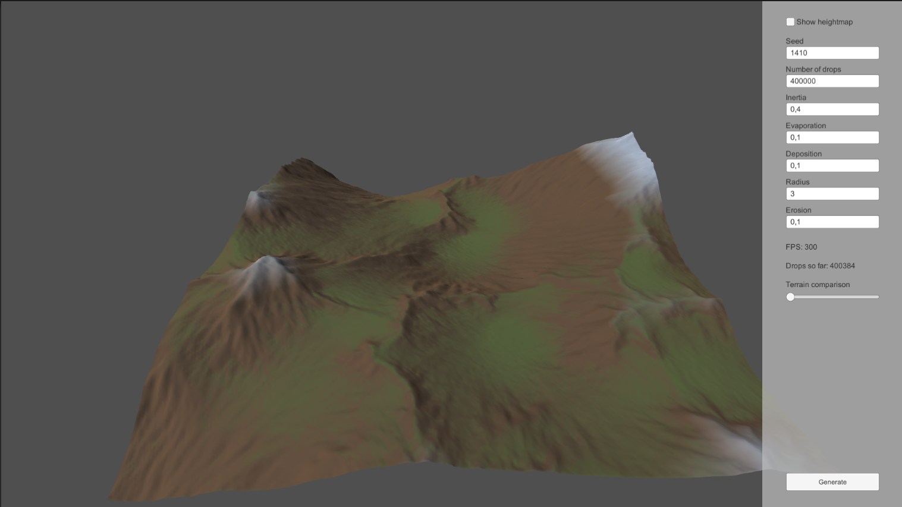
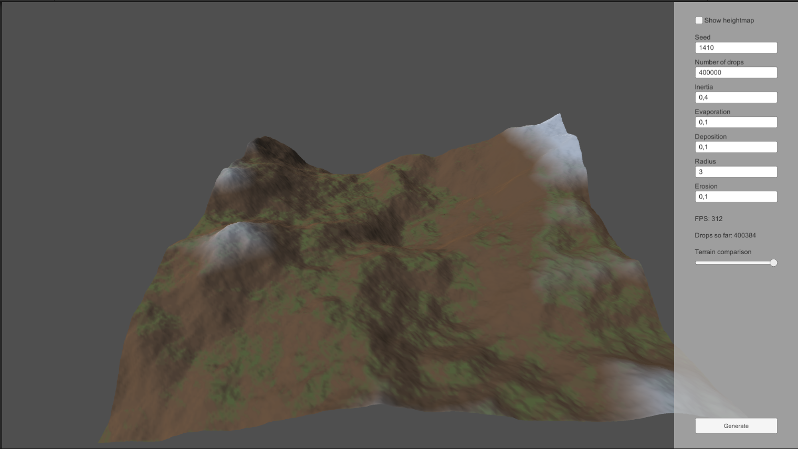

# A Level Computer Science project simulating hydraulic erosion

Unity demonstration of the technology of simulating hydraulic erosion for procedural generation of terrain. Employs compute shaders for parallel computation of drops.

